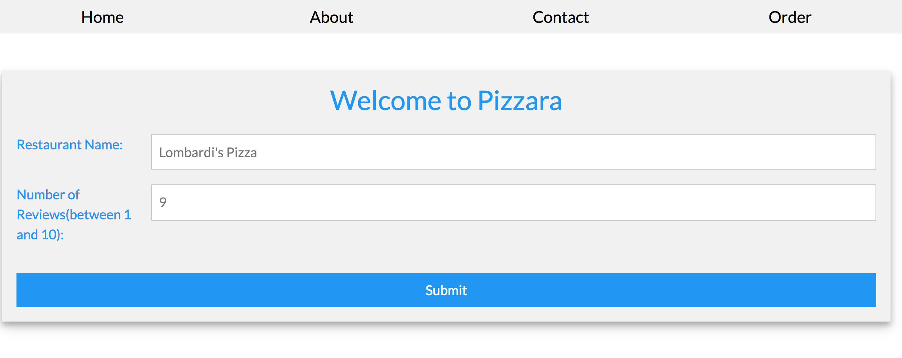
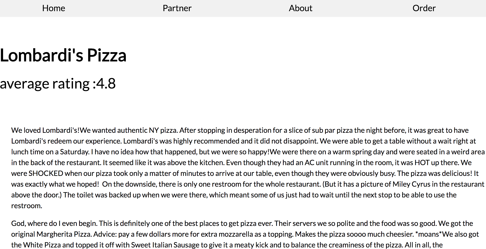

# Pizzara - Yelp Restaurant Review


## Intallation


	 - Flask, Tornado
	 - Python Libraries(Request, LXML)
	 - Other: Jquery, JqueryValidation(this is already referenced in the html file)


Start Web Server
	 
```
sudo -E python tornadoapp.py

```
## Main Logic:

Main logic is under view.py. I utilized LXML to send a request searching for restaurant and scrape data for reviews based on the hmtl elements on the page. Here is an example of how the reviews were retrieved. Rating was extraced in similar fashion

```
raw_reviews = tree.xpath("//div[contains(@class,'review-content')]//p[@lang='en']")

```


## Main Entry:
Type "localhost"" in browser after starting web server



## Search For Reviews
Type in name of the restaurant and number of reviews(1-10).




